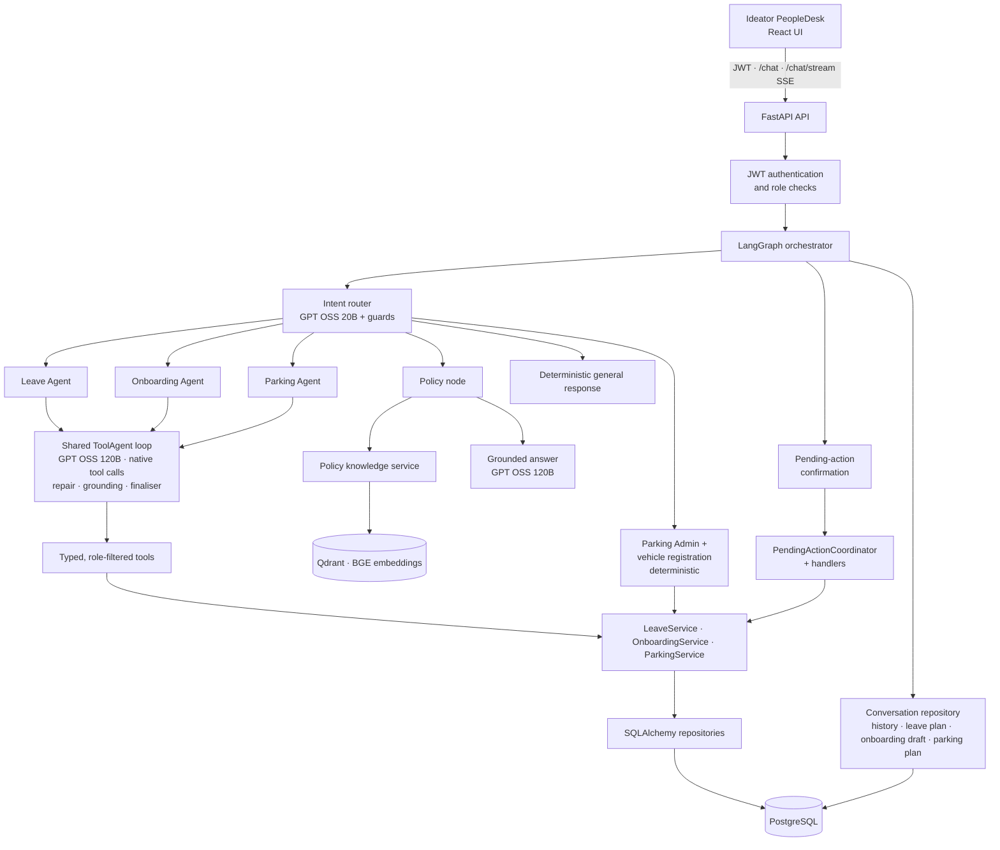
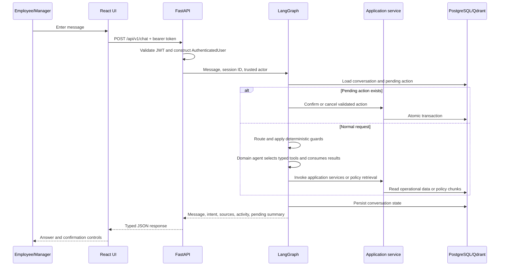
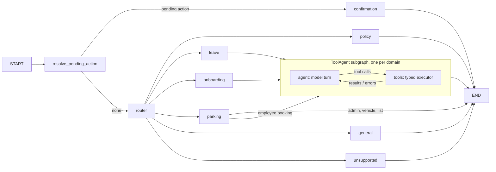

# Ideator PeopleDesk — As-Built Technical Architecture

This document describes the implementation currently present in the repository. The assessment
release implements authenticated HR policy, leave, employee-onboarding, employee-parking, and
Parking Administrator attendance lifecycles end to end.

## 1. Architecture goals

- Provide one authenticated conversational HR interface.
- Ground policy answers in company documents with visible sources.
- Let the model decide which tools to call and in what order; keep every fact in tool results.
- Keep identity, authorization, calculations, and writes outside the LLM.
- Use deterministic application services for business-critical operations.
- Require explicit human confirmation before every mutation.
- Preserve conversation context and an auditable request lifecycle.
- Control inference cost with tiered models, deterministic guards, and call budgets.
- Remain extensible without presenting incomplete workflows as finished features.

## 2. Implemented stack

| Area | Technology |
|---|---|
| Frontend | React, TypeScript, Vite, Nginx |
| API | Python 3.12, FastAPI, Pydantic |
| Agent orchestration | LangGraph |
| LLM provider | Amazon Bedrock Mantle, OpenAI-compatible chat completions |
| Operational storage | PostgreSQL, SQLAlchemy, Alembic |
| Policy retrieval | Qdrant, BAAI/bge-small-en-v1.5 |
| PDF extraction | Native PDF text with 300-DPI OCR fallback |
| Authentication | JWT bearer tokens |
| Testing | Pytest and a versioned live-model golden dataset |
| Packaging | Docker and Docker Compose |

## 3. System overview



The low-cost model proposes the top-level domain. Leave, onboarding and employee parking then run
the same bounded tool-calling loop (`app/agent/runtime.py`), where the model selects typed
operations and consumes their structured results. It does not receive authority to identify a
different employee, bypass role checks, calculate business values, or commit a transaction.

## 4. Repository layers

```text
frontend/                         React presentation
backend/app/api/                  HTTP routes, schemas, dependencies
backend/app/agent/                Orchestrator, shared ToolAgent loop, Leave/Onboarding/Parking agents and tools
backend/app/application/          Leave, onboarding, parking, notification and pending-action use cases
backend/app/domain/               Entities, enums, and deterministic rules
backend/app/rag/                  Policy extraction, chunking, ingestion, retrieval
backend/app/infrastructure/       Database, repositories, embeddings, Qdrant, LLM adapter
backend/evals/                    Versioned golden behavior suite
```

Dependencies point inward: HTTP and LangGraph call application services; services depend on ports
and domain objects; infrastructure implements storage and provider adapters.

## 5. Authenticated request lifecycle



The JWT supplies `user_id`, `employee_id`, and `role`. User text and model output cannot overwrite
those values.

### Live agent activity (`POST /api/v1/chat/stream`)

The UI calls a streaming twin of `/chat` with the same body and token. The orchestrator and the
shared ToolAgent loop report progress through an optional event sink, and the endpoint relays it as
Server-Sent Events:

| Event | Payload | Emitted when |
| --- | --- | --- |
| `step` | `{id, label, status}` (`running`, `success`, `error`) | routing finished, each model turn ("Thinking" → "Chose: building leave plan"), each tool call ("Building leave plan" → "Built leave plan"), self-corrections, policy retrieval |
| `final` | the same `ChatResponse` as `/chat` (including `agent_activity`) | the reply is ready |
| `error` | `{status, message}` | a failure after the stream started |

- Steps carry labels only, never tool arguments, balances or identifiers.
- Steps emitted before a role gate (routing) are held back until the first step from inside an
  agent or policy retrieval. An unauthorized request therefore still fails with its normal HTTP
  status (403) before any stream starts.
- The work runs in a worker thread with its own database session, because a request's dependency
  session closes before a streamed body is sent.
- `/chat` is unchanged; the evaluation suite and tests use it. The UI falls back to `/chat` if the
  stream endpoint is unavailable.

In the UI, the steps appear in the reply bubble while the agent works (a spinner on the current step),
then the bubble becomes the normal reply with the existing "Agent activity" panel.

## 6. Implemented LangGraph

The application compiles one graph with these nodes:



### Shared state

The graph carries:

- Session and authenticated actor identifiers
- Current user message and recent message history
- Active domain
- Validated `RouteDecision`
- Pending action and user-facing summary
- Response and policy sources
- Agent activity events (tool label and status only)
- Per-request LLM call count
- The active leave plan, onboarding draft and parking plan (persisted per session)
- Validated parking date context for safe follow-up turns

### Routing

The router produces a validated Pydantic object containing domain, intent, confidence, leave type,
dates, reason, and request ID. Post-model guards enforce important invariants:

- Explicit self-service balance questions route to the authenticated employee's balance.
- Dates and leave types cannot be invented when the user did not provide them.
- Manager decisions require a request ID; rejection requires a reason.
- Policy-manipulation prompt attacks route directly to grounded retrieval.
- Low-confidence or invalid router output can escalate to the complex model tier.
- Each request has a strict maximum number of model calls.

## 7. Application tools and deterministic boundaries

Each agent uses native tool calling (or a JSON decision protocol when the provider lacks it) inside
its LangGraph subgraph. Its typed tool executor validates each call with Pydantic, filters tools by
role and invokes trusted Python code directly; the model never receives a repository or employee
identity argument.

| Capability | Implementation | Source of truth |
|---|---|---|
| Policy search | `PolicyKnowledgeService.search` | Qdrant policy chunks |
| Leave balance | `LeaveService.get_leave_balance` | PostgreSQL |
| Date words → dates | `resolve_leave_dates` | Python calendar rules |
| Working days | `LeaveService.calculate_leave_days` | Python rules + regional holidays |
| Eligibility / leave plan | `LeaveService.build_leave_plan` | Rules, balance, overlaps, split options |
| Leave application | Pending handler + `LeaveService` | Confirmed transaction |
| Employee requests | `LeaveService.get_my_leave_requests` | Authenticated employee |
| Manager queue | `LeaveService.get_managed_leave_requests` | Reporting hierarchy |
| Approve/reject | Pending handler + `LeaveService` | Authorized transaction |
| Cancel request | Pending handler + `LeaveService` | Request ownership |
| Audit history | `LeaveService.get_leave_request_history` | Request events |
| Policy search from Leave | `PolicyKnowledgeService.search` | Qdrant policy chunks and source metadata |
| Parking vehicle | `ParkingService.get_vehicle` | Authenticated employee vehicle |
| Parking availability | `ParkingService.check_availability` | PostgreSQL slots/reservations |
| Reserve/cancel | Pending handlers + `ParkingService` | Confirmed atomic transaction |
| Parking waitlist | Pending handler + `ParkingService` | PostgreSQL waitlist |
| Parking Admin queue | `ParkingService.get_daily_reservations` | `PARKING_ADMIN` role |
| Parking attendance | Pending handlers + `ParkingService` | Check-in, no-show, completion, override |

This separation prevents the LLM from performing arithmetic, generating authoritative employee
IDs, changing statuses, or constructing SQL.

## 8. Leave lifecycle

### Leave plans (agent path)

The Leave Agent never computes dates or day counts. It passes the employee's date words to
`resolve_dates` (`app/domain/leave/dates.py`), which returns exact dates and whether they are
separate days ("Tuesday and Sunday") or one range ("Tuesday to Sunday"). `build_leave_plan`
(`LeaveService.build_leave_plan`) validates those dates and returns a `LeavePlan`: contiguous
segments, weekends and holidays not counted, balance before and after, past-date rules (sick
leave up to 7 days back, other types from today), overlaps, and a fingerprint. The newest plan is
the conversation's active plan, persisted on the session and valid for 30 minutes.

When the balance is short, the plan lists `split_options` (other types with enough balance); only
after the employee agrees does the agent rebuild it with `split_with`, so the remaining days are
covered by the second type. `shift_leave_plan` moves the active plan by whole days ("same leave next
week"). Privilege Leave (PL) is a separate legacy balance handled in iAssistant, not Earned Leave.

"Apply it" means `prepare_leave_application(plan_id)`: the executor rebuilds the plan, requires
the same fingerprint, and stores an `apply_leave_plan` pending action. On confirmation the
handler rebuilds the plan again inside the transaction and creates one request per segment, so
the days the employee was shown are exactly the days submitted.

### Read operations

- Balance responses combine total, used, and pending days.
- Eligibility excludes weekends and the employee's regional holidays (Tamil Nadu for Chennai,
  Karnataka for Bengaluru, from the 2026 holiday list PDFs).
- Active overlapping requests prevent duplicate leave applications.
- Employees can read only their own requests.
- Managers see direct-report requests; HR can see the authorized broader queue.

### Mutating operations

```text
User request
  → domain route → Leave Agent tool selection
  → validate fields and authorization
  → calculate/revalidate business rules
  → store expiring PendingAction
  → show summary
  → explicit yes/cancel
  → revalidate inside transaction
  → execute once
  → append audit event
  → remove pending action
```

Pending actions are owned by both session and authenticated user, expire automatically, and are
consumed atomically. Approval consumes balance only after confirmation. Replay attempts cannot
execute the same action twice.

### Shared agent loop safeguards (all three agents)

- Tool errors and repeated calls are returned to the model as results, so it can correct its
  arguments or explain the factual reason; a second identical repeat ends the turn.
- Invalid model output gets one repair turn that shows the model the validation error
  (`LEAVE_AGENT_MAX_REPAIRS`).
- Grounding check: every number in the final answer must appear in this turn's tool results,
  the active plan, the conversation or today's date; otherwise the model regenerates once.
- If repair fails, the reply is rendered only from tool results already returned (plan summary,
  balance, request list or the tool error); the user's words are never pattern-matched to guess.
- Domain finaliser (`finalize` hook, deterministic, never writes): presents tool results in fixed
  wording when the model's answer omits key facts (balances, day counts, plan summary), asks for
  exactly the missing detail ("Please provide the leave type…"), and finishes a workflow the model
  stopped short of — an eligible plan on an "apply" request, a complete onboarding draft or a
  ready parking plan goes straight to the confirmation step.
- Limits per message: 6 model rounds, 8 tool calls, 8 LLM calls in total (configurable).
- Every model turn and tool call is reported to the optional live-activity sink (section 5).
- Native provider tool calling is used when `LEAVE_AGENT_NATIVE_TOOLS=true`; check support first
  with `python -m app.llm.probe`. Otherwise the JSON decision protocol is used.

### Onboarding Agent

Onboarding runs on the same shared loop (`app/agent/runtime.py`) as the Leave Agent, with its own
typed tools (`app/agent/onboarding_tools.py`):

- Manager/HR: `update_onboarding_draft` (every value must be stated in the user's message;
  employment type Permanent/Contract/Intern, location Chennai/Bengaluru, joining date today or
  later, manager matched to one eligible employee), `build_onboarding_plan`, `prepare_onboarding`,
  `list_reporting_managers`, `check_employee_exists`, `get_onboarding_status`.
- HR Admin: `list_onboarding_approvals`, `get_onboarding_request`, `prepare_onboarding_approval`,
  `prepare_onboarding_rejection`.
- Role gates run before the agent and tool authorization failures are raised, so unauthorized
  requests return HTTP 403. Credentials are generated only at confirmation and never reach a model.
- The inline form posts structured `onboarding_form` values that are written straight into the same
  draft (no text parsing, no model call); details given in chat are returned as `onboarding_draft`
  and pre-fill the form.
- Department reply emails (`POST /api/v1/inbound/email`) require the `X-Inbound-Token` shared
  secret (`INBOUND_EMAIL_TOKEN`).

### Parking Agent

Employee booking conversations (availability, reserve, cancel, waitlist) run on the shared loop
with `app/agent/parking_tools.py`: `resolve_dates`, `get_vehicle`, `list_parking_slots` (every
active slot with free/taken per date; regular slots first, accessible B-25 last),
`build_parking_plan` (one chosen slot for one or more dates; dates where it is taken return the
free alternatives, and the employee picks another slot or the waitlist), `prepare_parking`
(pending `reserve_parking_plan`, rebuilt and fingerprint-checked at confirmation) and
`prepare_parking_cancellation`. A slot code or "waitlist" is accepted only when the employee wrote
it, so the assistant never chooses a slot. With two registered vehicles the plan asks which one,
and the chosen registration travels through the plan, the confirmation and the reservation.
Vehicle registration, listing, update and removal (refused while an upcoming booking uses the
vehicle), the reservation list and Parking Admin actions keep their deterministic handlers.

## 9. Policy RAG

### Ingestion

```text
32 policy PDFs
  → native text extraction
  → 300-DPI OCR fallback for image-only pages
  → extraction confidence checks
  → section-aware overlapping chunks
  → BGE embeddings
  → idempotent document replacement in Qdrant
```

Each chunk preserves document, page, section, and category metadata. Unreadable non-blank pages
fail ingestion instead of silently creating poor evidence.

### Retrieval and answer generation

```text
Policy question
  → query expansion for selected HR terminology
  → query embedding
  → top-k Qdrant search with score threshold
  → context containing source boundaries
  → constrained GPT OSS 120B answer
  → response cleanup
  → grouped source metadata in the UI
```

The answer prompt requires a direct, short, plain-text response and forbids adding unsupported
rules. No matches above the threshold produce an insufficient-evidence error rather than a
hallucinated answer.

## 10. Model routing and cost controls

| Tier | Model | Use |
|---|---|---|
| Router | `openai.gpt-oss-20b` | Normal structured routing with low reasoning effort |
| Standard | `openai.gpt-oss-120b` | Domain agents (tool calling) and grounded policy answers |
| Complex | `openai.gpt-oss-120b` | Low-confidence or invalid routing fallback with medium effort |

Cost and stability controls include:

- Deterministic business responses after routing
- Deterministic greeting/capability response
- Security and extraction guards before/after model routing
- Small router output budget
- Per-tier output-token limits
- Maximum model calls per request
- Retrieval limited to top-k evidence
- No reasoning-model call during confirmation execution

## 11. Persistence model

| Table | Purpose |
|---|---|
| `employees` | Employee profile and reporting manager relationship |
| `users` | Login identity, password hash, role, employee link |
| `conversation_sessions` | Recent conversation state and active domain |
| `pending_actions` | Expiring, single-use action awaiting confirmation |
| `leave_balances` | Total and used days by employee and leave type |
| `leave_requests` | Dates, working days, status, manager, decision metadata |
| `leave_request_events` | Immutable lifecycle/audit entries |
| `holidays` | Regional holiday calendars excluded from working-day calculations |
| `onboarding_requests`, `onboarding_tasks` | Onboarding request, approval state and provisioning tasks |
| `vehicles` | Up to two active vehicles per employee (service rule; migration 0011); unique registration numbers; soft-removed with `active = false` |
| `parking_slots` | Database-backed workplace parking inventory |
| `parking_reservations` | Reservation and attendance lifecycle state |
| `parking_reservation_events` | Auditable reservation status transitions and reasons |
| `parking_waitlist` | One active waitlist entry per employee and date |

Alembic owns schema evolution. PostgreSQL constraints, foreign keys, indexes, row locking, and
application transactions support integrity and concurrency safety.

### Tracing (optional Langfuse)

`app/core/tracing.py` wraps the Langfuse SDK and is a no-op unless the `LANGFUSE_*` settings are
present. The orchestrator opens one `chat` trace per message (user ID, session ID, role tag); the
router, each domain agent, every typed tool call, policy retrieval and confirmations are nested
observations, and `MantleLLMGateway` records every model call as a generation with token usage.
A mask removes one-time passwords, passwords and bearer tokens, and the credential-bearing
onboarding-approval reply is withheld. Self-hosting: `observability/README.md`.

## 12. Security controls

- Passwords use a modern one-way password hash.
- Accounts activated by onboarding carry `must_change_password`; until the employee sets a new
  password (`POST /api/v1/auth/change-password`: 10+ characters, mixed case, a digit, not the
  username), every API except login, profile and password change answers 403
  `password_change_required`.
- JWT expiry and signature validation happen in FastAPI dependencies.
- Employee identity is derived only from the validated token.
- Service-layer checks enforce employee ownership and manager/HR roles.
- Model-produced fields are validated by Pydantic and deterministic guards.
- Prompt injection cannot change policy evidence or bypass confirmation.
- CORS is restricted to configured origins.
- Secrets stay in the ignored `.env` file and are never returned to the UI.
- Structured logs include request IDs without logging credentials or JWTs.

## 13. Frontend

Ideator PeopleDesk provides:

- Employee, manager, and HR demo login selection
- JWT-authenticated session storage
- Role-aware prompts and request/approval panels
- Policy source display grouped by document and pages
- Pending-action Confirm and Cancel controls
- Live agent steps while a reply is being prepared (streamed), then the Agent activity panel
- Responsive desktop/mobile layout
- Explicit status and error presentation

The frontend renders server decisions; it is not an authorization boundary.

## 14. Quality strategy

- **289 deterministic tests** cover authentication, security, date resolution, leave plans and
  rules, the shared agent loop (repair, grounding, finaliser), onboarding approval and account
  activation, parking, pending actions, manager lifecycle, RAG, orchestration, live streaming,
  evaluation contracts, and the repeatable demo seed. Agent tests use scripted model simulators.
- **117 versioned golden scenarios** exercise the live API and configured models across policy,
  leave, onboarding, parking, manager workflow, safety, scope, and API safety, three times each.
- Release gate: at least 95% overall pass rate and consistency, and 100% for safety, API safety,
  onboarding and parking. Reports are written to `backend/evals/reports/` (ignored by Git).
- Latest full run (5 Oct 2026, 117 cases × 3, 438 turns): **99.1% pass rate, 99.3% consistency**;
  safety, API safety and onboarding 100%, parking 97% (one wording miss). The four misses (one
  provider 503, a model-corrected reversed range, a number written in words, a reworded date
  prompt) have deterministic fixes and regression tests.
- The React production build is compiled with TypeScript before packaging.

## 15. Deployment and demo reset

Docker Compose runs four services:

```text
frontend :5173  → Nginx serving the Vite build
backend  :8000  → FastAPI/Uvicorn
postgres :5432  → operational database
qdrant   :6333  → policy vectors
```

Backend startup applies Alembic migrations and performs non-destructive idempotent seeding. Before
a recording, the explicit reset command clears only demo-identity activity and restores known
balances, the five parking slots and the employee account's vehicle:

```bash
docker compose exec -T backend python -m app.seed --reset-demo
```

## 16. Future extensions

All three workflows now share one pattern, so a new domain needs a tool executor, a prompt and
(optionally) a finaliser on top of the shared loop:

```text
validated route
  → domain agent (shared ToolAgent loop) → typed tools → application service
  → pending action for mutations
  → confirmation → revalidation → atomic execution and audit event
```

Planned next: half-day leave, a manager team-leave calendar, approver notifications, and the HR
use cases recorded in the post-submission backlog.
