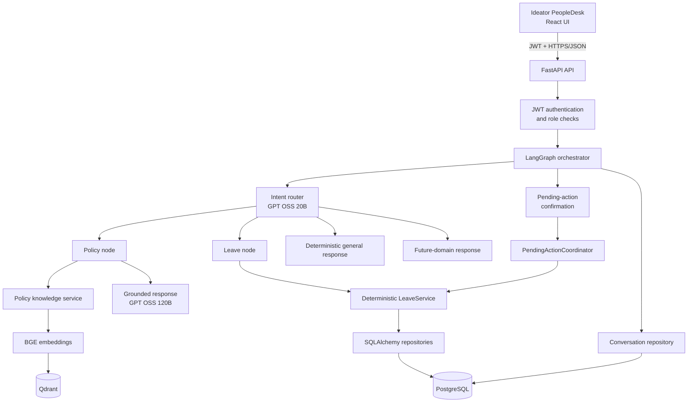
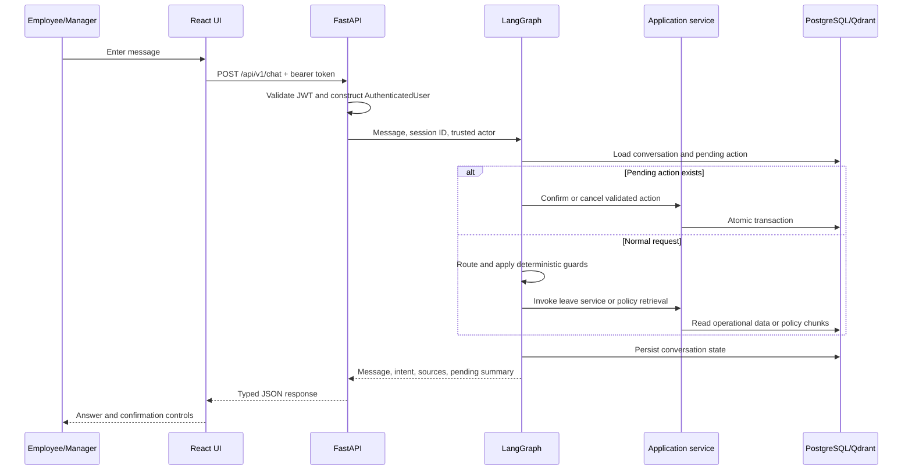
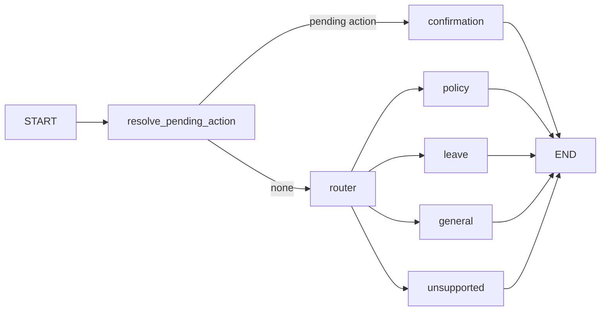

# Ideator PeopleDesk — As-Built Technical Architecture

This document describes the implementation currently present in the repository. The assessment
release implements authenticated HR policy, leave, and employee-onboarding lifecycles end to end;
parking remains a future extension.

## 1. Architecture goals

- Provide one authenticated conversational HR interface.
- Ground policy answers in company documents with visible sources.
- Keep identity, authorization, calculations, and writes outside the LLM.
- Use deterministic application services for business-critical operations.
- Require explicit human confirmation before every mutation.
- Preserve conversation context and an auditable request lifecycle.
- Control inference cost with tiered models, deterministic guards, and call budgets.
- Remain extensible without presenting incomplete workflows as finished features.

## 2. Implemented stack

| Area | Technology |
|---|---|
| Frontend | React, TypeScript, Vite, Nginx |
| API | Python 3.12, FastAPI, Pydantic |
| Agent orchestration | LangGraph |
| LLM provider | Amazon Bedrock Mantle, OpenAI-compatible chat completions |
| Operational storage | PostgreSQL, SQLAlchemy, Alembic |
| Policy retrieval | Qdrant, BAAI/bge-small-en-v1.5 |
| PDF extraction | Native PDF text with 300-DPI OCR fallback |
| Authentication | JWT bearer tokens |
| Testing | Pytest and a versioned live-model golden dataset |
| Packaging | Docker and Docker Compose |

## 3. System overview



The model proposes routing and structured fields. It does not receive authority to identify a
different employee, bypass role checks, calculate final business values, or commit a transaction.

## 4. Repository layers

```text
frontend/                         React presentation
backend/app/api/                  HTTP routes, schemas, dependencies
backend/app/agent/                LangGraph state and orchestration
backend/app/application/          Leave and pending-action use cases
backend/app/domain/               Entities, enums, and deterministic rules
backend/app/rag/                  Policy extraction, chunking, ingestion, retrieval
backend/app/infrastructure/       Database, repositories, embeddings, Qdrant, LLM adapter
backend/evals/                    Versioned golden behavior suite
```

Dependencies point inward: HTTP and LangGraph call application services; services depend on ports
and domain objects; infrastructure implements storage and provider adapters.

## 5. Authenticated request lifecycle



The JWT supplies `user_id`, `employee_id`, and `role`. User text and model output cannot overwrite
those values.

## 6. Implemented LangGraph

The application compiles one graph with these nodes:



### Shared state

The graph carries:

- Session and authenticated actor identifiers
- Current user message and recent message history
- Active domain
- Validated `RouteDecision`
- Pending action and user-facing summary
- Response and policy sources
- Per-request LLM call count

### Routing

The router produces a validated Pydantic object containing domain, intent, confidence, leave type,
dates, reason, and request ID. Post-model guards enforce important invariants:

- Explicit self-service balance questions route to the authenticated employee's balance.
- Dates and leave types cannot be invented when the user did not provide them.
- Manager decisions require a request ID; rejection requires a reason.
- Policy-manipulation prompt attacks route directly to grounded retrieval.
- Low-confidence or invalid router output can escalate to the complex model tier.
- Each request has a strict maximum number of model calls.

## 7. Application tools and deterministic boundaries

The implementation uses tool-like application-service invocations from LangGraph. They are not
model-native function calls: the orchestrator selects a validated operation and invokes trusted
Python code directly.

| Capability | Implementation | Source of truth |
|---|---|---|
| Policy search | `PolicyKnowledgeService.search` | Qdrant policy chunks |
| Leave balance | `LeaveService.get_leave_balance` | PostgreSQL |
| Working days | `LeaveService.calculate_leave_days` | Python rules + holidays |
| Eligibility | `LeaveService.check_leave_eligibility` | Rules, balance, overlaps |
| Leave application | Pending handler + `LeaveService` | Confirmed transaction |
| Employee requests | `LeaveService.get_my_leave_requests` | Authenticated employee |
| Manager queue | `LeaveService.get_managed_leave_requests` | Reporting hierarchy |
| Approve/reject | Pending handler + `LeaveService` | Authorized transaction |
| Cancel request | Pending handler + `LeaveService` | Request ownership |
| Audit history | `LeaveService.get_leave_request_history` | Request events |

This separation prevents the LLM from performing arithmetic, generating authoritative employee
IDs, changing statuses, or constructing SQL.

## 8. Leave lifecycle

### Read operations

- Balance responses combine total, used, and pending days.
- Eligibility excludes weekends and seeded holidays.
- Active overlapping requests prevent duplicate leave applications.
- Employees can read only their own requests.
- Managers see direct-report requests; HR can see the authorized broader queue.

### Mutating operations

```text
User request
  → structured route
  → validate fields and authorization
  → calculate/revalidate business rules
  → store expiring PendingAction
  → show summary
  → explicit yes/cancel
  → revalidate inside transaction
  → execute once
  → append audit event
  → remove pending action
```

Pending actions are owned by both session and authenticated user, expire automatically, and are
consumed atomically. Approval consumes balance only after confirmation. Replay attempts cannot
execute the same action twice.

## 9. Policy RAG

### Ingestion

```text
32 policy PDFs
  → native text extraction
  → 300-DPI OCR fallback for image-only pages
  → extraction confidence checks
  → section-aware overlapping chunks
  → BGE embeddings
  → idempotent document replacement in Qdrant
```

Each chunk preserves document, page, section, and category metadata. Unreadable non-blank pages
fail ingestion instead of silently creating poor evidence.

### Retrieval and answer generation

```text
Policy question
  → query expansion for selected HR terminology
  → query embedding
  → top-k Qdrant search with score threshold
  → context containing source boundaries
  → constrained GPT OSS 120B answer
  → response cleanup
  → grouped source metadata in the UI
```

The answer prompt requires a direct, short, plain-text response and forbids adding unsupported
rules. No matches above the threshold produce an insufficient-evidence error rather than a
hallucinated answer.

## 10. Model routing and cost controls

| Tier | Model | Use |
|---|---|---|
| Router | `openai.gpt-oss-20b` | Normal structured routing with low reasoning effort |
| Standard | `openai.gpt-oss-120b` | Grounded policy response generation |
| Complex | `openai.gpt-oss-120b` | Low-confidence or invalid routing fallback with medium effort |

Cost and stability controls include:

- Deterministic business responses after routing
- Deterministic greeting/capability response
- Security and extraction guards before/after model routing
- Small router output budget
- Per-tier output-token limits
- Maximum model calls per request
- Retrieval limited to top-k evidence
- No reasoning-model call during confirmation execution

## 11. Persistence model

| Table | Purpose |
|---|---|
| `employees` | Employee profile and reporting manager relationship |
| `users` | Login identity, password hash, role, employee link |
| `conversation_sessions` | Recent conversation state and active domain |
| `pending_actions` | Expiring, single-use action awaiting confirmation |
| `leave_balances` | Total and used days by employee and leave type |
| `leave_requests` | Dates, working days, status, manager, decision metadata |
| `leave_request_events` | Immutable lifecycle/audit entries |
| `holidays` | Dates excluded from working-day calculations |

Alembic owns schema evolution. PostgreSQL constraints, foreign keys, indexes, row locking, and
application transactions support integrity and concurrency safety.

## 12. Security controls

- Passwords use a modern one-way password hash.
- JWT expiry and signature validation happen in FastAPI dependencies.
- Employee identity is derived only from the validated token.
- Service-layer checks enforce employee ownership and manager/HR roles.
- Model-produced fields are validated by Pydantic and deterministic guards.
- Prompt injection cannot change policy evidence or bypass confirmation.
- CORS is restricted to configured origins.
- Secrets stay in the ignored `.env` file and are never returned to the UI.
- Structured logs include request IDs without logging credentials or JWTs.

## 13. Frontend

Ideator PeopleDesk provides:

- Employee, manager, and HR demo login selection
- JWT-authenticated session storage
- Role-aware prompts and request/approval panels
- Policy source display grouped by document and pages
- Pending-action Confirm and Cancel controls
- Responsive desktop/mobile layout
- Explicit status and error presentation

The frontend renders server decisions; it is not an authorization boundary.

## 14. Quality strategy

- **114 deterministic tests** cover authentication, security, leave rules, onboarding approval and
  account activation, pending actions, manager lifecycle, RAG, orchestration, evaluation contracts,
  and repeatable demo seed.
- **85 versioned golden scenarios** exercise the live API and configured models across policy,
  leave, safety, scope, manager workflow, and API safety categories.
- The latest complete live release gate scored **98.7%** with **99.0% consistency**, above both
  configured 95% thresholds; safety, API-safety, and onboarding categories passed at **100%**.
- Hardened regression scenarios for greeting stability, policy injection, and missing dates passed
  at **100%** after deterministic guards were added.
- The React production build is compiled with TypeScript before packaging.

## 15. Deployment and demo reset

Docker Compose runs four services:

```text
frontend :5173  → Nginx serving the Vite build
backend  :8000  → FastAPI/Uvicorn
postgres :5432  → operational database
qdrant   :6333  → policy vectors
```

Backend startup applies Alembic migrations and performs non-destructive idempotent seeding. Before
a recording, the explicit reset command clears only demo-identity activity and restores a known
balance and approval scenario:

```bash
docker compose exec -T backend python -m app.seed --reset-demo
```

## 16. Future extensions

Employee onboarding now uses the same validated, confirmed, atomic workflow pattern as leave.
Parking remains a future phase and is reported transparently as unavailable. New domains can reuse
the existing pattern:

```text
validated route
  → domain application service
  → repository port
  → pending action for mutations
  → confirmation
  → atomic execution and audit event
```

This keeps the assessment release focused on one complete, demonstrable HR workflow while leaving
an intentional path for additional employee services.
