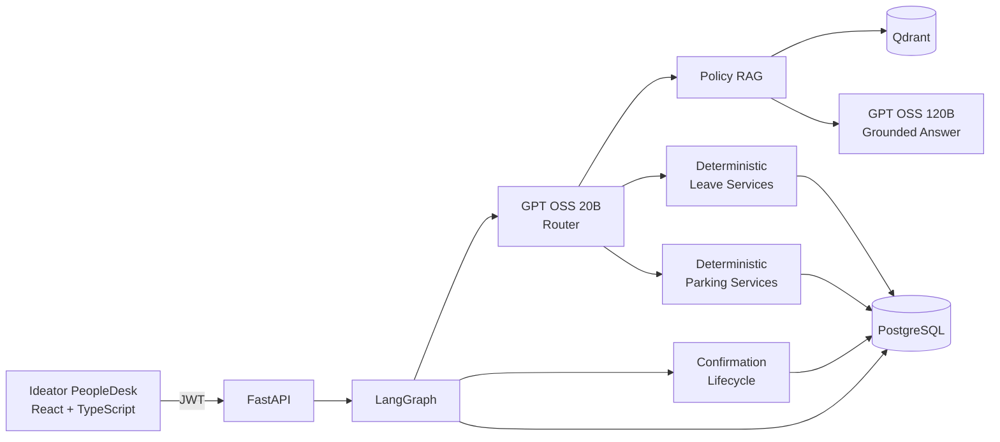

# Ideator PeopleDesk

Ideator PeopleDesk is an authenticated Agentic HR help desk for ideas2it employees. It answers HR
questions from company policy documents and executes leave, onboarding, and workplace parking workflows against trusted employee data
with deterministic rules, role-based authorization, human confirmation, and an auditable lifecycle.

The assessment release completes the HR policy, leave, employee-onboarding, employee parking,
and Parking Administrator attendance workflows end to end.

## What it demonstrates

- Authenticated employee, manager, HR, HR administrator, and Parking Administrator experiences
- LangGraph intent routing and multi-turn conversation state
- Grounded policy RAG over 32 PDFs with document/page attribution
- Dynamic leave balances, eligibility, working-day calculation, and request history
- Leave application, cancellation, manager approval, and rejection workflows
- Manager/HR onboarding requests with independent HR administrator approval
- Atomic employee account activation, default balances, and one-time temporary credentials
- Database-backed parking availability, reservation, lookup, cancellation, and waitlist workflows
- Parking Admin queue, check-in, late cancellation, no-show, completion, and override workflows
- Explicit confirmation before every database mutation
- Deterministic business rules and service-layer authorization outside the LLM
- Cost-aware Amazon Bedrock Mantle model routing
- Prompt-injection, replay, ownership, and invented-field protections
- Versioned golden evaluation and repeatable demo data

## Architecture



The LLM proposes an intent and structured fields. Authenticated identity, authorization,
calculations, confirmation, transactions, and audit events remain controlled by application code.

See [ARCHITECTURE.md](ARCHITECTURE.md) for the complete as-built design and
[PROJECT_SPEC.md](PROJECT_SPEC.md) for the phased source requirements.

## Assessment coverage

| Requirement | Implementation |
|---|---|
| Authenticated employees | JWT login and trusted `AuthenticatedUser` context |
| Policy questions | Qdrant retrieval and grounded GPT OSS 120B response with sources |
| Dynamic employee information | PostgreSQL-backed balances and request lifecycle |
| Calculations | Python working-day, holiday, overlap, and balance rules |
| Tool usage | LangGraph invokes validated policy, leave, onboarding, and parking services |
| Agent workflow | Structured routing, conditional graph nodes, context, and escalation |
| Safe actions | Expiring pending actions and explicit Confirm/Cancel step |
| Manager workflow | Direct-report queue, approve/reject, balance update, audit history |
| Onboarding workflow | Four provisioning tasks, HR Admin approval, account activation, employee login |
| Parking workflow | Availability, reservation/cancellation, waitlist, admin attendance, and three-strike suspension |
| Quality evidence | 141 automated tests and 99 live golden scenarios |

## Quick start with Docker

Prerequisites: Docker Desktop and an Amazon Bedrock Mantle API key with access to the configured
models.

```bash
cp .env.example .env
```

Set `BEDROCK_API_KEY` in `.env`, then start the stack:

```bash
docker compose up --build
```

On the first run, index the policy library:

```bash
docker compose exec -T backend python -m app.rag.ingestion
```

Open:

- PeopleDesk UI: [http://localhost:5173](http://localhost:5173)
- FastAPI documentation: [http://localhost:8000/docs](http://localhost:8000/docs)
- Health check: [http://localhost:8000/api/v1/health](http://localhost:8000/api/v1/health)

Docker Compose starts React/Nginx, FastAPI, PostgreSQL, and Qdrant. Backend startup applies Alembic
migrations and performs non-destructive, idempotent seeding.

## Demo accounts

| Role | Username | Password |
|---|---|---|
| Employee | `employee` | `employee123` |
| Manager | `manager` | `manager123` |
| HR | `hr` | `hr12345` |
| HR Administrator | `hradmin` | `hradmin123` |
| Parking Administrator | `parkingadmin` | `parkingadmin123` |

These credentials are intentionally non-sensitive and exist only for local demonstration.

Reset the five demo identities to a predictable state before recording:

```bash
docker compose exec -T backend python -m app.seed --reset-demo
```

The reset clears demo conversations, pending actions, leave and parking activity, and onboarding requests
created by demo identities—including any accounts activated from them. It restores the documented
passwords, balances, registered vehicles, five parking slots, one occupied-slot scenario, and one
pending Casual Leave request for the manager flow. Policy vectors, schema, and unrelated employees
are not changed.

Follow [DEMO_SCRIPT.md](DEMO_SCRIPT.md) for the exact 6–8 minute assessment walkthrough.

## Implemented agent flow

```text
POST /api/v1/chat
  → validate JWT and load trusted actor
  → load conversation and pending action
  → resolve confirmation first, when present
  → otherwise route the request
       ├─ policy  → retrieve Qdrant evidence → grounded response + sources
       ├─ leave   → deterministic application service
       ├─ onboarding → deterministic request, review, and account activation services
       ├─ parking → deterministic availability and employee parking service
       └─ general → deterministic capability response
  → persist conversation state
  → return message, intent, sources, and pending-action summary
```

Application and manager decisions follow a two-turn lifecycle:

```text
request → validate → propose pending action → explicit confirmation → revalidate → atomic write
```

No leave, onboarding, or parking mutation is executed directly from model output.

## Application tools

LangGraph invokes tool-like application services directly rather than allowing the model to run SQL
or native provider function calls.

| Area | Operations |
|---|---|
| Policy | Search policy evidence and return source metadata |
| Employee leave | Balance, holidays, calculation, eligibility, apply, list, cancel |
| Manager/HR | Approval queue, approve, reject, request audit history |
| Employee parking | Vehicle, availability, reserve, list, cancel, and waitlist |
| Parking Admin | Daily queue, check-in, late cancellation, no-show, completion, and override |
| Confirmation | Propose, inspect, cancel, expire, and atomically execute pending actions |

Every self-service operation derives employee identity from the JWT. Manager scope is derived from
the reporting relationship stored in PostgreSQL.

## Bedrock Mantle model cascade

| Tier | Model | Purpose |
|---|---|---|
| Router | `openai.gpt-oss-20b` | Low-cost structured routing and field extraction |
| Standard | `openai.gpt-oss-120b` | Grounded policy response generation |
| Complex | `openai.gpt-oss-120b` | Medium-effort fallback for uncertain/invalid routing |

Cost controls include small routing outputs, per-tier token limits, a maximum call budget, top-k
retrieval, deterministic greetings and guards, and no reasoning-model call during confirmed action
execution.

Configuration is available in `.env.example`. Keep the real `.env` untracked.

## Policy ingestion

Place PDFs in `backend/policy_docs`, then run:

```bash
docker compose exec -T backend python -m app.rag.ingestion
```

The pipeline prefers native PDF text and uses 300-DPI OCR fallback for image-only pages. It performs
confidence checks, creates overlapping section-aware chunks, embeds them with
`BAAI/bge-small-en-v1.5`, and idempotently replaces each document in Qdrant. Metadata preserves the
document, page, section, and category.

## API surface

- `GET /api/v1/health`
- `POST /api/v1/auth/login`
- `GET /api/v1/auth/me`
- `POST /api/v1/chat`
- `GET /api/v1/leave/requests`
- `POST /api/v1/leave/requests/{id}/cancel`
- `GET /api/v1/leave/requests/{id}/history`
- `GET /api/v1/manager/leave-requests`
- `POST /api/v1/manager/leave-requests/{id}/approve`
- `POST /api/v1/manager/leave-requests/{id}/reject`
- `GET /api/v1/parking/me/suspension`
- `GET /api/v1/parking/reservations/{id}/history`
- `GET /api/v1/parking-admin/reservations`

All endpoints other than health and login require a bearer token.

Example chat payload:

```json
{
  "message": "How many casual leave days do I have?",
  "session_id": "optional-client-session-id"
}
```

Reuse the returned `session_id` for follow-up messages and confirmation.

## Testing and evaluation

Python 3.12 or newer is required for local backend development.

```bash
cd backend
python3.12 -m venv .venv
source .venv/bin/activate
pip install -e '.[dev]'
pytest
```

Current deterministic result: **141 passed**.

Validate or run the live golden dataset:

```bash
cd backend
.venv/bin/python evals/run_golden.py --dry-run
.venv/bin/python evals/run_golden.py --fail-under 0.95
./evals/run_quality_gate.sh
```

The dataset contains **99 scenarios** covering policy grounding, routing, leave rules,
confirmations, manager, onboarding, and parking workflows, authorization, prompt injection, scope, and API
safety. The release gate requires at least 95% overall pass rate and consistency, plus 100% for
safety, API-safety, onboarding, and parking categories. Mutating cases are skipped unless
`--include-mutating` is supplied and should run only against a reset demo database.

Reports are generated as ignored JSON and HTML files under `backend/evals/reports/`.

Build the frontend independently with:

```bash
cd frontend
npm install
npm run build
```

## Repository structure

```text
frontend/                   Ideator PeopleDesk React application
backend/app/agent/          LangGraph orchestration and state
backend/app/application/    Leave, onboarding, parking, and pending-action use cases
backend/app/domain/         Deterministic domain entities and business rules
backend/app/infrastructure/ Provider and persistence adapters
backend/app/rag/            PDF ingestion and policy retrieval
backend/tests/              Deterministic test suite
backend/evals/              Golden behavior dataset and runner
backend/policy_docs/        Assessment policy PDFs
```

## Implemented scope and future phases

Completed:

- Authentication and conversation foundation
- Deterministic leave domain
- Reusable confirmation lifecycle
- Policy RAG
- LangGraph conversational orchestration
- Manager approval lifecycle and audit events
- Ideator PeopleDesk assessment frontend
- Golden behavior evaluation and demo reset
- New-employee onboarding, HR Admin approval, and employee account activation
- Workplace parking persistence foundation: vehicles, slots, reservations, waitlist, lifecycle audit,
  concurrency constraints, configuration, and repeatable demo data
- Employee parking chat workflow with confirmation-time revalidation and conversation context
- Parking Admin queue, check-in, late cancellation with reason, no-show enforcement, completion,
  no-show override, and three-strike suspension

Future phases:

- Production identity provider and managed secret storage
- Production observability and deployment hardening

The employee parking and Parking Administrator workflows are complete for the assessment scope.
