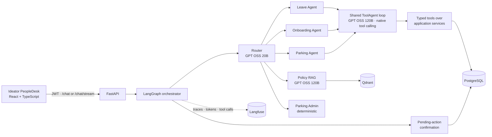

# Ideator PeopleDesk

Ideator PeopleDesk is an authenticated Agentic HR help desk for ideas2it employees. It answers HR
questions from company policy documents and executes leave, onboarding, and workplace parking workflows against trusted employee data
with deterministic rules, role-based authorization, human confirmation, and an auditable lifecycle.

The assessment release completes the HR policy, leave, employee-onboarding, employee parking,
and Parking Administrator attendance workflows end to end.

## Submission at a glance

| Item | Where |
|---|---|
| Demo video | `<demo video link>` |
| Architecture | [ARCHITECTURE.md](ARCHITECTURE.md) (diagrams, LangGraph design, tools, security) and the summary below |
| Quality gate report | [docs/quality/QUALITY_REPORT.md](docs/quality/QUALITY_REPORT.md): 308 automated tests; live golden set 117 cases × 3 runs, **99.1% pass, 99.3% consistency** |
| Observability | Self-hosted **Langfuse** traces for every message: routing, model calls with tokens, tool calls, retrieval ([Observability](#observability-langfuse)) |
| Demo walkthrough | [DEMO_FLOW.md](DEMO_FLOW.md) (step-by-step prompts with values) and [DEMO_SCRIPT.md](DEMO_SCRIPT.md) |
| Features and agentic behaviour | [FEATURES.md](FEATURES.md): features per role, onboarding email in/out and status extraction, where the model decides |
| Roles | [ROLES_AND_RESPONSIBILITIES.md](ROLES_AND_RESPONSIBILITIES.md) |

## What it demonstrates

- Authenticated employee, manager, HR, HR administrator, and Parking Administrator experiences
- A LangGraph orchestrator that routes each message to the policy RAG path or to one of three
  tool-calling agents (Leave, Onboarding, Parking) built on one shared, bounded agent loop
- Grounded policy RAG over 32 PDFs with document/page attribution
- Leave **plans**: separate days vs ranges ("Tuesday and Sunday" is two days), weekly offs and
  regional holidays (Chennai / Bengaluru) excluded, balance check, split across two leave types when
  one balance is short, and "same leave next week" shifts
- Leave application, cancellation, manager approval, rejection, and request history
- Onboarding in chat or by form (one shared draft) with independent HR administrator approval,
  atomic account activation and one-time credentials
- Up to two vehicles per employee (list, update, remove; blocked while a booking uses the vehicle)
- Separate car slots (B-21 to B-25) and motorcycle slots (M-01 to M-04): each vehicle sees and books
  only the slots for its type; the chosen slot's type picks the vehicle. Waitlist, and Parking Admin
  attendance workflows (check-in, late cancellation, no-show, completion, override)
- Explicit confirmation before every database mutation, revalidated at confirmation time
- **Live agent activity**: the UI shows each routing decision, model step and tool call while the
  reply is prepared, then keeps the list in an "Agent activity" panel
- Self-correcting loop: tool errors and ungrounded numbers are fed back to the model for one repair
- Versioned golden evaluation (117 cases, run three times) and a repeatable demo reset
- Langfuse tracing of every conversation (self-hosted, optional, secrets masked)

## Architecture



The router picks the domain. Inside a domain agent the model chooses which typed tools to call,
reads their results and decides the next step, within limits on rounds and tool calls. Identity,
authorization, date arithmetic, balances, eligibility, confirmation, transactions and audit events
stay in application code; the model can never write to the database directly.

### What is agentic, what is deterministic

| Concern | Who decides | How |
|---|---|---|
| Which domain a message belongs to | LLM router (20B) + deterministic guards | Structured JSON route, regex guards for known phrasings and attacks |
| Which tools to call and in what order | LLM (120B) in the domain agent | Native tool calling; results are fed back each round |
| Recovering from a tool error or an ungrounded number | LLM, with feedback | One repair turn with the exact error; otherwise a reply built from tool results |
| Dates ("next week Wednesday", "15th next month", "Tue and Sun") | Python | `resolve_dates` tool; the model never does calendar arithmetic |
| Working days, holidays, balances, eligibility, split options | Python | `build_leave_plan` and the leave service |
| Finishing a workflow the model stopped short of | Python | e.g. an eligible plan on an "apply" request goes straight to confirmation |
| Who may do what | Python | JWT identity and role gates (403 before any model call) |
| Writing to the database | The user | Pending action → explicit "yes" → revalidate → atomic write + audit |

### Why LangGraph

The orchestrator and each agent are small state graphs: routing, confirmation and domain handling are
explicit nodes, and the agent loop is an `agent ⇄ tools` cycle with conditional edges and hard
limits. That gives inspectable, testable control flow around a model that only chooses tools, and
lets three domain agents share one loop implementation.

See [ARCHITECTURE.md](ARCHITECTURE.md) for the complete as-built design,
[FEATURES.md](FEATURES.md) for every feature by role (including onboarding's outbound and inbound
department emails and how task status is extracted from them) and where the system is agentic,
[docs/quality/QUALITY_REPORT.md](docs/quality/QUALITY_REPORT.md) for the latest quality gate run, and
[PROJECT_SPEC.md](PROJECT_SPEC.md) for the phased source requirements.

## Assessment coverage

| Requirement | Implementation |
|---|---|
| Authenticated employees | JWT login and a trusted `AuthenticatedUser` injected into every tool |
| Policy questions | Qdrant retrieval and a grounded GPT OSS 120B answer with source documents and pages |
| Dynamic employee information | PostgreSQL-backed balances, requests, onboarding and parking records |
| Calculations | Python date resolution, working days, regional holidays, overlap and balance rules |
| Tool usage | Three agents call typed tools (leave: 15, onboarding: 10, parking: 7) over application services |
| Agent workflow | LangGraph routing, a bounded self-correcting tool loop, multi-turn context and live activity |
| Context handling | Conversation history, the active leave/parking plan and the onboarding draft persist per session |
| Safe actions | Expiring pending actions, explicit Confirm/Cancel, revalidation before the write |
| Manager workflow | Direct-report queue, approve/reject, balance update, audit history |
| Onboarding workflow | Provisioning tasks, HR Admin approval, account activation, employee login |
| Parking workflow | Slot board and choice, reservation/cancellation, waitlist, admin attendance, three-strike suspension |
| Quality evidence | 308 automated tests; 117-case live golden set × 3: 99.1% pass, 99.3% consistency ([report](docs/quality/QUALITY_REPORT.md)) |
| Observability | Langfuse trace per message: router, agent, tool calls, model generations with token usage |

## Quick start with Docker

Prerequisites: Docker Desktop and an Amazon Bedrock Mantle API key with access to the configured
models.

```bash
cp .env.example .env
```

Set `BEDROCK_API_KEY` in `.env`, then start the stack:

```bash
docker compose up --build
```

On the first run, index the policy library:

```bash
docker compose exec -T backend python -m app.rag.ingestion
```

Open:

- PeopleDesk UI: [http://localhost:5173](http://localhost:5173)
- FastAPI documentation: [http://localhost:8000/docs](http://localhost:8000/docs)
- Health check: [http://localhost:8000/api/v1/health](http://localhost:8000/api/v1/health)

Docker Compose starts React/Nginx, FastAPI, PostgreSQL, and Qdrant. Backend startup applies Alembic
migrations and performs non-destructive, idempotent seeding.

## Demo accounts

| Role | Username | Password |
|---|---|---|
| Employee | `employee` | `Advik!Desk-2026` |
| Manager | `manager` | `Saanvika!Desk-2026` |
| HR | `hr` | `Hariharan!Desk-2026` |
| HR Administrator | `hradmin` | `Alaguselvi!Desk-2026` |
| Parking Administrator | `parkingadmin` | `Dhaswanth!Desk-2026` |

These credentials exist only for local demonstration. Accounts activated through onboarding get a
one-time temporary password and must set their own on first sign-in.

Reset the five demo identities to a predictable state before recording:

```bash
docker compose exec -T backend python -m app.seed --reset-demo
```

The reset clears demo conversations, pending actions, leave requests, parking reservations and
waitlist entries, and onboarding requests created by demo identities—including any accounts
activated from them. It restores the documented passwords and leave balances, the five parking
slots, and the employee account's registered vehicle (TN01AR1001). Newly onboarded employees
register their own vehicle in chat. Policy vectors, schema, and unrelated employees are not changed.

Follow [DEMO_FLOW.md](DEMO_FLOW.md) for the paste-ready demo flow (or open
[DEMO_FLOW.html](DEMO_FLOW.html) for Copy buttons), [DEMO_SCRIPT.md](DEMO_SCRIPT.md) for the narrated walkthrough and
[ROLES_AND_RESPONSIBILITIES.md](ROLES_AND_RESPONSIBILITIES.md) for the authorization hierarchy.

## Implemented agent flow

```text
POST /api/v1/chat            (POST /api/v1/chat/stream sends the same reply plus live steps)
  → validate JWT and load trusted actor
  → load conversation, active plan/draft and pending action
  → a pending action exists?  → confirm / cancel / remind (no model call to execute)
  → otherwise route the request (router model + deterministic guards)
       ├─ policy      → retrieve Qdrant evidence → grounded answer + sources
       ├─ leave       → Leave Agent      ┐
       ├─ onboarding  → Onboarding Agent ├─ shared ToolAgent loop → typed tools → grounded reply
       ├─ parking     → Parking Agent    ┘   (role gate first; 403 before any model call)
       ├─ parking admin → deterministic Parking Admin services
       └─ general     → deterministic capability response
  → persist conversation state (history, leave plan, onboarding draft, parking plan)
  → return message, intent, sources, agent activity, and pending-action summary
```

The shared loop, per turn:

```text
model turn → tool calls → results (or errors) fed back → model turn → … → final answer
  · at most 6 model rounds, 8 tool calls and 8 LLM calls per message; repeated identical calls are refused
  · numbers in the answer must appear in tool results, else one repair turn
  · a domain finaliser can present results in fixed wording or finish the workflow
    (e.g. stage the confirmation for an eligible plan); it never writes data
```

Every mutation follows a two-turn lifecycle:

```text
plan → prepare (PendingAction) → explicit "yes" → revalidate (plan fingerprint) → atomic write + audit
```

## Application tools

Each agent sees only its own typed tools, filtered by role. Read tools run immediately; `prepare_*`
tools only create a PendingAction.

| Agent | Tools |
|---|---|
| Leave | resolve_dates, get_leave_balance, build_leave_plan, shift_leave_plan, get_holidays, calculate_leave_days, get_my_leave_requests, get_leave_request_history, get_leave_rules, search_leave_policy, get_managed_leave_requests, prepare_leave_application / cancellation / approval / rejection |
| Onboarding | update_onboarding_draft, list_reporting_managers, check_employee_exists, build_onboarding_plan, prepare_onboarding, get_onboarding_status, list_onboarding_approvals, get_onboarding_request, prepare_onboarding_approval / rejection |
| Parking | resolve_dates, get_vehicle, list_parking_slots, build_parking_plan, prepare_parking, get_my_parking_reservations, prepare_parking_cancellation |
| Parking Admin (deterministic) | Daily queue, check-in, late cancellation, no-show, completion, override |

Every operation derives the employee from the JWT; tool arguments that try to name another employee
are rejected. Manager scope comes from the reporting relationship stored in PostgreSQL.

## Bedrock Mantle model cascade

| Tier | Model | Purpose |
|---|---|---|
| Router | `openai.gpt-oss-20b` | Low-cost structured routing and field extraction |
| Standard | `openai.gpt-oss-120b` | Domain agents (native tool calling) and grounded policy answers |
| Complex | `openai.gpt-oss-120b` | Medium-effort fallback for uncertain/invalid routing |

Cost controls include small routing outputs, per-tier token limits, a maximum call budget, top-k
retrieval, deterministic greetings and guards, and no reasoning-model call during confirmed action
execution.

Configuration is available in `.env.example`. Keep the real `.env` untracked.

## Observability (Langfuse)

Every chat message can be traced in a self-hosted [Langfuse](https://langfuse.com): routing, each
model call (prompt, reply, tokens, latency), each tool call, policy retrieval and confirmations,
grouped by session and user. Tracing is off unless `LANGFUSE_PUBLIC_KEY`, `LANGFUSE_SECRET_KEY` and
`LANGFUSE_HOST` are set; secrets and one-time passwords are masked before export.

```bash
./observability/langfuse-up.sh        # Langfuse UI at http://localhost:3000
```

Setup, keys and login: [observability/README.md](observability/README.md).

## Policy ingestion

Place PDFs in `backend/policy_docs`, then run:

```bash
docker compose exec -T backend python -m app.rag.ingestion
```

The pipeline prefers native PDF text and uses 300-DPI OCR fallback for image-only pages. It performs
confidence checks, creates overlapping section-aware chunks, embeds them with
`BAAI/bge-small-en-v1.5`, and idempotently replaces each document in Qdrant. Metadata preserves the
document, page, section, and category.

## API surface

- `GET /api/v1/health`
- `POST /api/v1/auth/login`
- `POST /api/v1/auth/change-password`
- `GET /api/v1/auth/me`
- `POST /api/v1/chat`
- `POST /api/v1/chat/stream` (Server-Sent Events: `step` … `final`)
- `GET /api/v1/leave/requests`
- `POST /api/v1/leave/requests/{id}/cancel`
- `GET /api/v1/leave/requests/{id}/history`
- `GET /api/v1/manager/leave-requests`
- `POST /api/v1/manager/leave-requests/{id}/approve`
- `POST /api/v1/manager/leave-requests/{id}/reject`
- `GET /api/v1/parking/me/vehicles`
- `GET /api/v1/parking/me/suspension`
- `GET /api/v1/parking/reservations/{id}/history`
- `GET /api/v1/parking-admin/reservations`
- `GET /api/v1/manager/onboarding/reporting-managers`, `/employee-exists`, `/status/by-employee`, `/{id}`
- `POST /api/v1/manager/onboarding/plan`
- `GET /api/v1/hr-admin/onboarding/pending`
- `POST /api/v1/inbound/email` (requires the `X-Inbound-Token` header)

All endpoints other than health and login require a bearer token.

Example chat payload:

```json
{
  "message": "How many casual leave days do I have?",
  "session_id": "optional-client-session-id"
}
```

Reuse the returned `session_id` for follow-up messages and confirmation.

## Testing and evaluation

Python 3.12 or newer is required for local backend development.

```bash
cd backend
python3.12 -m venv .venv
source .venv/bin/activate
pip install -e '.[dev]'
pytest
```

Current deterministic result: **289 passed**. Latest live golden run: **99.1%** pass rate, **99.3%** consistency.

Validate or run the live golden dataset:

```bash
cd backend
.venv/bin/python evals/run_golden.py --dry-run
.venv/bin/python evals/run_golden.py --fail-under 0.95
./evals/run_quality_gate.sh
```

Reset the demo data first (`python -m app.seed --reset-demo`) so the parking cases find the demo
vehicle. The dataset contains **117 scenarios** covering policy grounding, routing, leave rules,
confirmations, manager, onboarding, and parking workflows, authorization, prompt injection, scope, and API
safety. The release gate requires at least 95% overall pass rate and consistency, plus 100% for
safety, API-safety, onboarding, and parking categories. Mutating cases are skipped unless
`--include-mutating` is supplied and should run only against a reset demo database.

Reports are generated as ignored JSON and HTML files under `backend/evals/reports/`.

Build the frontend independently with:

```bash
cd frontend
npm install
npm run build
```

## Repository structure

```text
frontend/                   Ideator PeopleDesk React application
backend/app/agent/          LangGraph orchestrator, shared ToolAgent loop, three agents and their tools
backend/app/application/    Leave, onboarding, parking, and pending-action use cases
backend/app/domain/         Deterministic domain entities and business rules
backend/app/infrastructure/ Provider and persistence adapters
backend/app/rag/            PDF ingestion and policy retrieval
backend/tests/              Deterministic test suite
backend/evals/              Golden behavior dataset and runner
backend/policy_docs/        Assessment policy PDFs
```

## Implemented scope and future phases

Completed:

- Authentication and conversation foundation
- Deterministic leave domain
- Reusable confirmation lifecycle
- Policy RAG
- LangGraph conversational orchestration
- Manager approval lifecycle and audit events
- Ideator PeopleDesk assessment frontend
- Golden behavior evaluation and demo reset
- New-employee onboarding, HR Admin approval, and employee account activation
- Workplace parking persistence foundation: vehicles, slots, reservations, waitlist, lifecycle audit,
  concurrency constraints, configuration, and repeatable demo data
- Employee parking chat workflow with confirmation-time revalidation and conversation context
- Parking Admin queue, check-in, late cancellation with reason, no-show enforcement, completion,
  no-show override, and three-strike suspension

- Leave plans with separate days, regional holidays, split leave and plan shifts
- Shared tool-calling runtime with native tool calls, repair turns and grounding checks
- Onboarding and Parking agents on the shared runtime; parking slot board and choice
- Live agent activity streamed to the UI

Future phases (see the post-submission backlog):

- Half-day leave, leave calendar for managers, notifications to approvers

- Production identity provider and managed secret storage
- Production observability and deployment hardening

The employee parking and Parking Administrator workflows are complete for the assessment scope.
